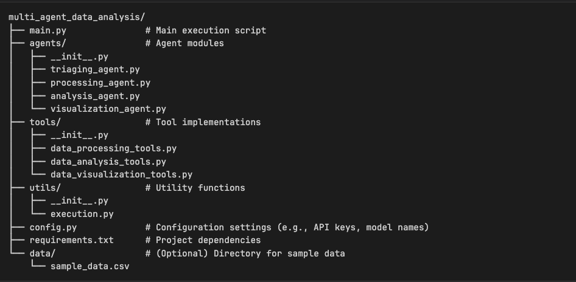
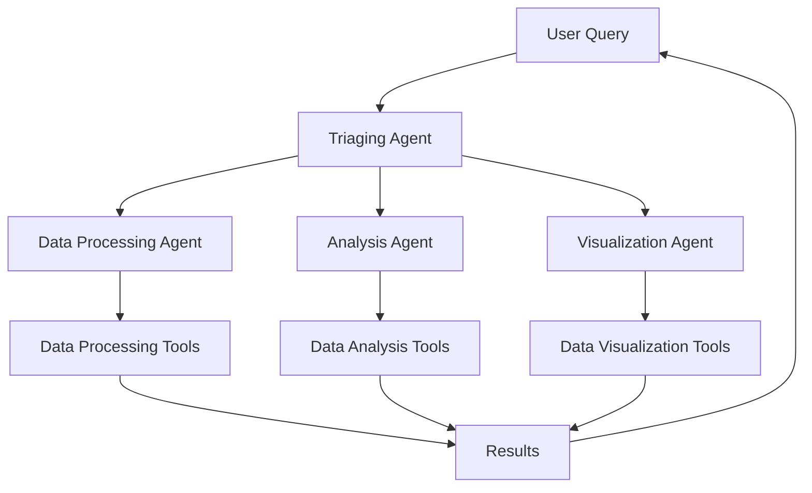
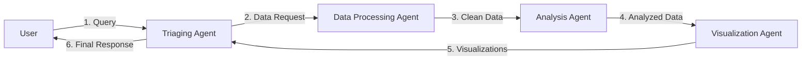
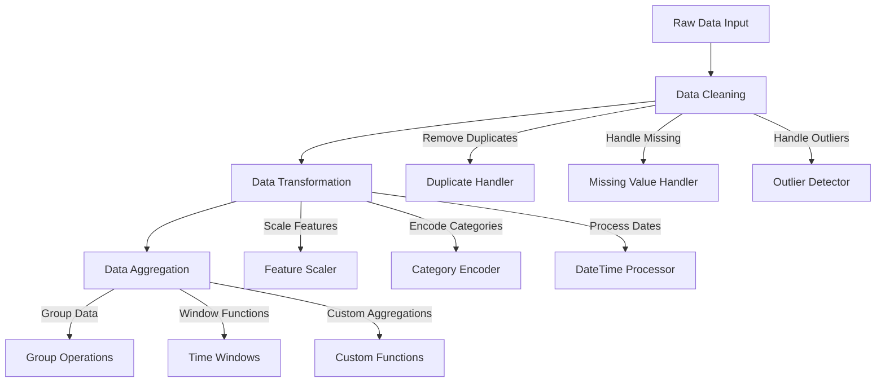
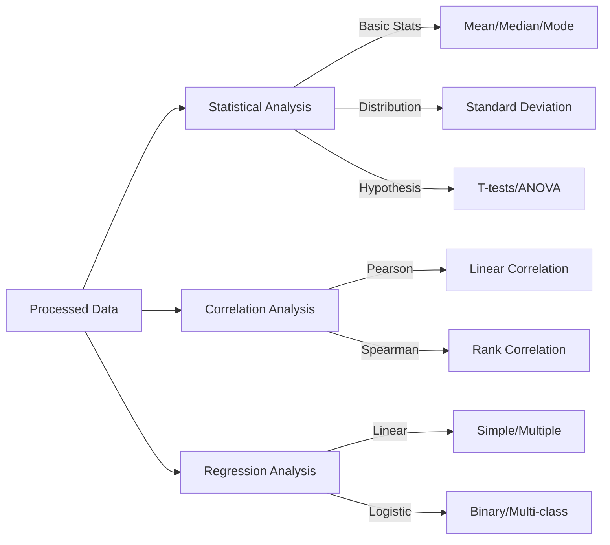
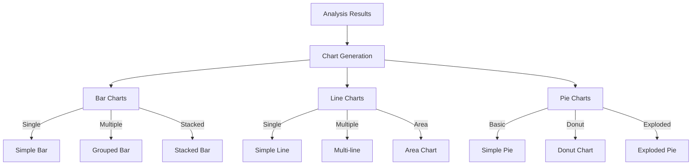
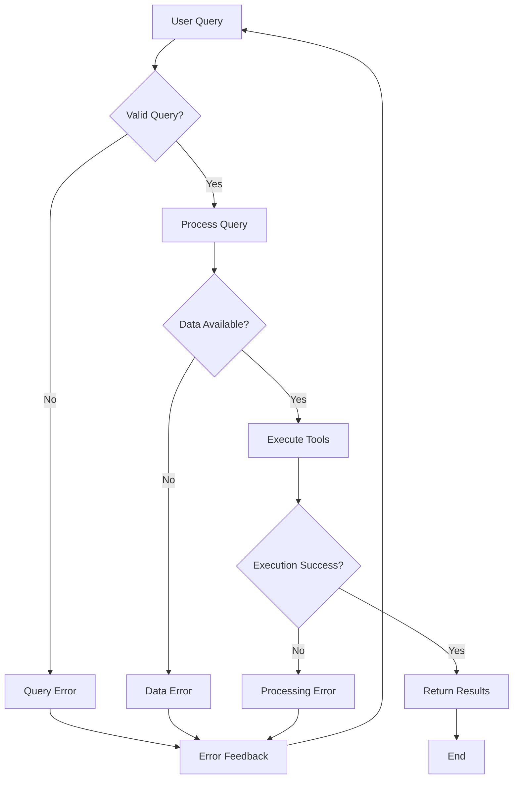

## Project tree



## System Architecture Diagrams

### High-Level System Overview


### Agent Communication Flow


### Data Processing Tools Detail


### Analysis Tools Workflow


### Visualization Tools Components


### Error Handling Flow


# Multi-Agent Data Analysis System

## Table of Contents

1. [Introduction](#introduction)
2. [Project Overview](#project-overview)
3. [System Architecture](#system-architecture)
    *   [3.1 Agents](#agents)
        *   [3.1.1 Triaging Agent](#triaging-agent)
        *   [3.1.2 Data Processing Agent](#data-processing-agent)
        *   [3.1.3 Analysis Agent](#analysis-agent)
        *   [3.1.4 Visualization Agent](#visualization-agent)
    *   [3.2 Tools](#tools)
        *   [3.2.1 Data Processing Tools](#data-processing-tools)
        *   [3.2.2 Data Analysis Tools](#data-analysis-tools)
        *   [3.2.3 Data Visualization Tools](#data-visualization-tools)
    *   [3.3 Execution and Workflow](#execution-and-workflow)
4. [Getting Started](#getting-started)
    *   [4.1 Prerequisites](#prerequisites)
    *   [4.2 Installation](#installation)
5. [Usage](#usage)
    *   [5.1 Running the System](#running-the-system)
    *   [5.2 Example Query](#example-query)
6. [Configuration](#configuration)
7. [Project Structure](#project-structure)
8. [Contributing](#contributing)
9. [License](#license)

## 1. Introduction <a name="introduction"></a>

This project implements a multi-agent system designed for comprehensive data analysis. It leverages the OpenAI API to create intelligent agents capable of processing, analyzing, and visualizing data. The system is built around a modular architecture, allowing for easy extension and customization.

## 2. Project Overview <a name="project-overview"></a>

The Multi-Agent Data Analysis System is designed to handle a variety of data-related tasks through the collaboration of specialized agents. Users can input queries, and the system will intelligently route these queries to the appropriate agents, execute the necessary tools, and return the results. The system supports data cleaning, transformation, aggregation, statistical analysis, correlation analysis, regression analysis, and the creation of various charts (bar, line, pie).

## 3. System Architecture <a name="system-architecture"></a>

### 3.1 Agents <a name="agents"></a>

The system is composed of several specialized agents, each designed to handle specific tasks and implemented using OpenAI's GPT-4 model:

#### 3.1.1 Triaging Agent <a name="triaging-agent"></a>

The Triaging Agent is the entry point for user queries, implemented in `agents/triage_agent.py`. It uses natural language processing to understand and categorize user requests.

**Key Responsibilities:**
* Assess user queries using semantic analysis
* Route queries to appropriate agents based on intent classification
* Interact with users for additional information using a structured dialogue system
* Maintain context across multiple interactions
* Handle error cases and provide meaningful feedback

**Example Interaction:**
```
User: "I need to analyze sales data trends"
Agent: "I'll help you analyze sales trends. Could you specify:
1. The time period you're interested in
2. Specific metrics you want to analyze
3. Any particular visualization preferences?"
```

#### 3.1.2 Data Processing Agent <a name="data-processing-agent"></a>

The Data Processing Agent (`agents/data_processing_agent.py`) handles all data preparation tasks using pandas and numpy.

**Key Responsibilities:**
* Clean data by:
  - Removing duplicates
  - Handling missing values (imputation/deletion)
  - Standardizing formats
  - Detecting and handling outliers
* Transform data through:
  - Feature scaling
  - Encoding categorical variables
  - Date/time processing
  - Custom transformations
* Aggregate data using:
  - Multiple grouping levels
  - Various aggregation functions (sum, mean, median, custom)
  - Time-based windows

#### 3.1.3 Analysis Agent <a name="analysis-agent"></a>

The Analysis Agent performs statistical, correlation, and regression analysis on the data.

**Key Responsibilities:**

*   Perform statistical analysis.
*   Calculate correlation coefficients.
*   Perform regression analysis.

#### 3.1.4 Visualization Agent <a name="visualization-agent"></a>

The Visualization Agent creates various types of charts (bar, line, pie) from the data.

**Key Responsibilities:**

*   Create bar charts.
*   Create line charts.
*   Create pie charts.

### 3.2 Tools <a name="tools"></a>

The system utilizes a set of tools to perform specific data operations:

#### 3.2.1 Data Processing Tools <a name="data-processing-tools"></a>

*   **`clean_data`** (`tools/data_processing.py`):
  - Input: DataFrame, cleaning parameters
  - Output: Cleaned DataFrame
  - Supports: 
    * Multiple imputation strategies
    * Outlier detection algorithms
    * Custom cleaning rules
    
*   **`transform_data`**:
  - Supports multiple transformation types:
    * Numerical: StandardScaler, MinMaxScaler, RobustScaler
    * Categorical: OneHotEncoding, LabelEncoding
    * Text: TF-IDF, Word Embeddings
  - Configurable via JSON transformation rules

#### 3.2.2 Data Analysis Tools <a name="data-analysis-tools"></a>

*   **`stat_analysis`**: Performs statistical analysis on the dataset.
*   **`correlation_analysis`**: Calculates correlation coefficients between variables.
*   **`regression_analysis`**: Performs regression analysis on the dataset.

#### 3.2.3 Data Visualization Tools <a name="data-visualization-tools"></a>

*   **`create_bar_chart`**: Creates a bar chart from the provided data.
*   **`create_line_chart`**: Creates a line chart from the provided data.
*   **`create_pie_chart`**: Creates a pie chart from the provided data.

### 3.3 Execution and Workflow <a name="execution-and-workflow"></a>

The `utils/execution.py` script handles the execution of tools and the overall workflow of the system. It includes functions to execute specific tools based on the agent's response and to manage the conversation flow between the user and the agents.

**Key Functions:**

*   **`execute_tool`**: Executes specific tools based on the agent's response.
*   **`handle_user_message`**: Manages the conversation flow and interacts with the agents to process user queries.

## 4. Getting Started <a name="getting-started"></a>

### 4.1 Prerequisites <a name="prerequisites"></a>

* Python 3.8 or higher
* OpenAI API Key with GPT-4 access
* Required Python packages:
  - pandas >= 1.5.0
  - numpy >= 1.21.0
  - matplotlib >= 3.5.0
  - seaborn >= 0.11.0
  - scikit-learn >= 1.0.0
  - openai >= 1.0.0
  - python-dotenv >= 0.19.0

### 4.2 Installation <a name="installation"></a>

1. Clone the repository:
    ```bash
    git clone https://github.com/yourusername/multi-agent-data-analysis.git
    cd multi-agent-data-analysis
    ```

2. Create and activate a virtual environment:
    ```bash
    python -m venv venv
    # On Windows
    .\venv\Scripts\activate
    # On Unix or MacOS
    source venv/bin/activate
    ```

3. Install the required packages:
    ```bash
    pip install -r requirements.txt
    ```

4. Set up your OpenAI API Key:
    * Create a `.env` file in the root directory
    * Add your configuration:
    ```env
    OPENAI_API_KEY=your_api_key_here
    OPENAI_MODEL=gpt-4-0314
    LOG_LEVEL=INFO
    MAX_TOKENS=2000
    TEMPERATURE=0.7
    ```

## 5. Usage <a name="usage"></a>

### 5.1 Running the System <a name="running-the-system"></a>

To run the system, execute the `main.py` script:
